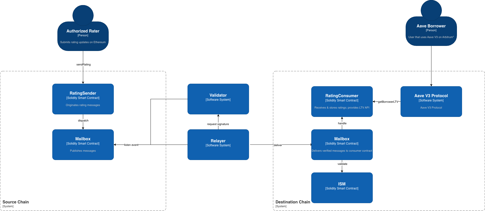

# A. High Level Architecture


# B. Hyperlane Configuration Strategy
## 1. ISM Type Selection

Recommended: Multisig ISM (5/7 threshold)
- Low latency: No optimistic challenge window, suitable for near-real-time rating updates that affect LTV.
- High integrity: Requires ≥5 independent validators to sign, strong protection against forged messages.
- Auditable: Signature verification happens fully on-chain, providing deterministic security guarantees.

## 2. Gas Payment Strategy

Recommended: Sender Pays
- Delivery gas on Arbitrum is paid by the Relayer and reimbursed via Hyperlane’s gas payment mechanism.
- Predictable costs for our system, easier accounting and monitoring

## 3. Security Model 
- Multisig ISM verifies validator signatures on-chain
- Consumer rejects messages older than the allowed timestamp threshold
- Nonce-based anti-replay logic

# C. Aave Integration Path
Aave simply reads the borrower’s rating-derived LTV from the RatingConsumer contract on Arbitrum.
```solidity
Aave V3 → RatingConsumer.getBorrowerLTV(borrower)
```

Integration Options

- Direct Read: Aave reads RatingConsumer directly, no protocol upgrade required
- Governance Adapter: A wrapper contract approved via governance, cleaner safety boundary

If ratings are missing, stale, or failed to deliver:
•	Use default conservative LTV
•	Or lowest tier (40%)

# D. Risk Assessment & Mitigation 
### Cross-Chain Message Forgery
An attacker could attempt to deliver a forged rating message to increase a borrower’s LTV.

Mitigation:
- Multisig ISM (5/7) signature verification on-chain
- Strict origin + sender contract checks in handle()
- Nonce-based replay prevention

### Stale or Delayed Messages
Hyperlane outage or network congestion may delay rating updates, leading to outdated LTV values.

Mitigation:
- RatingConsumer enforces timestamp freshness
- Stale messages automatically fallback to conservative LTV
- Aave continues operating normally without cross-chain dependency

### Incorrect Rating or Malicious Input
An authorized rater, backend service, or compromised API could submit an incorrect or malicious rating (e.g., inflated score), causing borrowers to receive artificially high LTV.

Mitigation:
- Strict AccessControl — only whitelisted raters can submit ratings
- On-chain event indexing for off-chain monitoring + audit logs of rating submissions

# E. Deployment Timeline & Partner Responsibilities

### Phase 1 — Testnet Integration (1–2 weeks)

Our Team:
- Deploy RatingSender (Ethereum Sepolia) & RatingConsumer (Arbitrum Sepolia)
- Configure Multisig ISM + validator set
- Set up relayer + monitoring
- Provide test scripts + example rating updates

Aave Team:
- Integrate getBorrowerLTV() read logic in test environment
- Validate fallback behavior and risk 

### Phase 2 — Testnet Validation & Security Review (1–2 weeks)

Our Team:
- Run end-to-end message delivery tests
- Stress test stale/freshness controls
- Provide rating-change history logs and documentation

Aave Team:
- Conduct internal risk review
- Perform integration QA
- Approve production readiness

### Phase 3 — Mainnet Deployment (1 week)

Our Team:
- Deploy contracts on Ethereum & Arbitrum mainnet
- Configure production ISM validators (5/7)
- Enable production relayer + gas payment setup

Aave Team:
- Point integration to mainnet RatingConsumer

### Phase 4 — Monitoring & Ongoing Operations

Our Team:
- Maintain validator & relayer uptime
- Monitor stale ratings, undelivered messages, or relayer failures
- Provide incident report and quick patch path when needed

Aave Team:
- Monitor LTV distribution changes
- Report anomalies or borrowers with unexpected LTV changes
